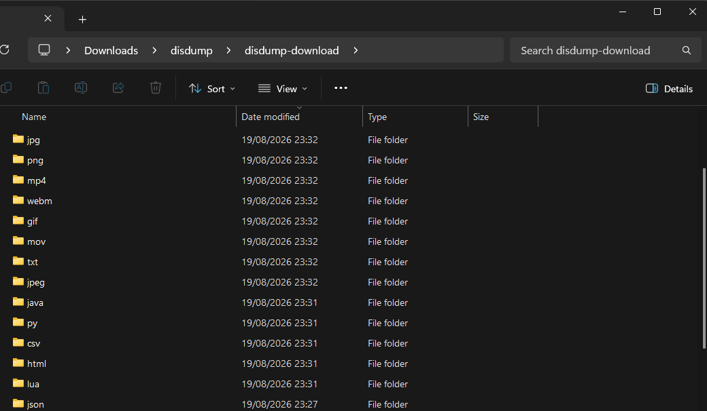
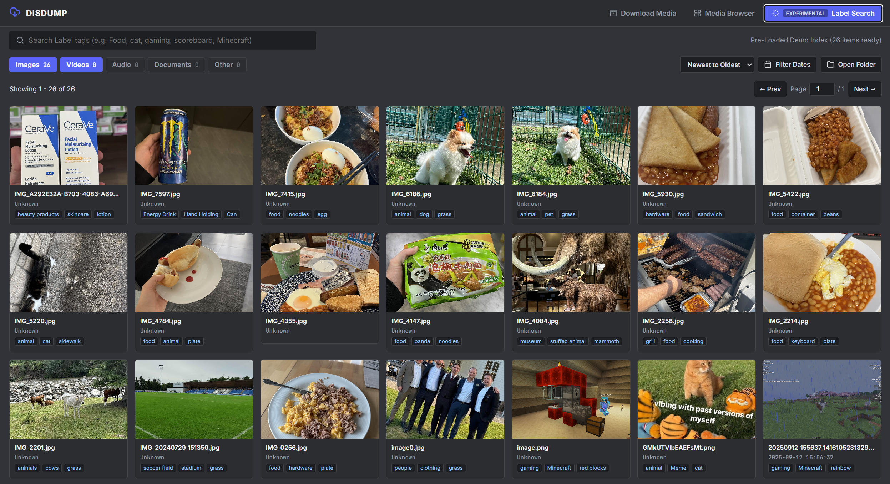

# DisDump

DisDump is a client-side web application that extracts, downloads, and organizes all media attachments referenced in your Discord data export (`package.zip`). It automatically sorts downloaded media into structured subfolders by file extension and provides a built-in media viewer.

Live Web App: https://dump.vincentchan.uk

## How It Works

When you request your data from Discord under **User Settings > Data & Privacy**, the delivered `package.zip` does not contain the actual media binaries. Instead, it contains raw text logs (`messages.json` and `.csv` files) containing your message history.

DisDump recovers your attachments directly through the browser:

1. **In-Memory Stream Parsing:** Using `fflate`, DisDump streams and reads your JSON/CSV message logs entirely in memory without uploading your data to any remote server.
2. **Attachment URL Extraction:** It scans message content and attachment properties for Discord CDN URLs (`cdn.discordapp.com` and `media.discordapp.net`)[cite: 3].
3. **Timestamp Normalization:** The original message timestamp is extracted and prepended to each filename (e.g., `YYYY-MM-DD_HH-MM-SS_filename.png`), preserving chronological ordering[cite: 3].
4. **Direct Disk Streaming:** Using the browser's native **File System Access API** (`showDirectoryPicker`), DisDump downloads up to 16 files concurrently and streams the raw binaries straight to your local drive into extension-based folders (`/png/`, `/jpg/`, `/mp4/`, `/pdf/`).



Because your browser fetches the actual files directly from Discord's content delivery network, a tiny 14 KB text archive can pull down tens of gigabytes of original media.

**Important Note:** If the original server, channel, or message was deleted, Discord purges the stored media from its servers. Those expired links will return 404 errors and cannot be recovered.

---

## Local & Offline Label Indexing

DisDump supports visual categorization and OCR search across all your saved media using a local vision-language model.



To index and search your downloaded media with visual tags and OCR using your own GPU:

- Setup instructions & documentation: [`label-script/README.md`](label-script/README.md)
- Python indexing script: [`label-script/qwen-rtx.py`](label-script/qwen-rtx.py)

## Self-Hosting

DisDump runs 100% client-side with no build step required. You can host it locally using Python:

```bash
# Clone the repository
git clone [https://github.com/wyOmar/DisDump.git](https://github.com/wyOmar/DisDump.git)
cd DisDump

# Start a local web server on port 8000
python -m http.server 8000